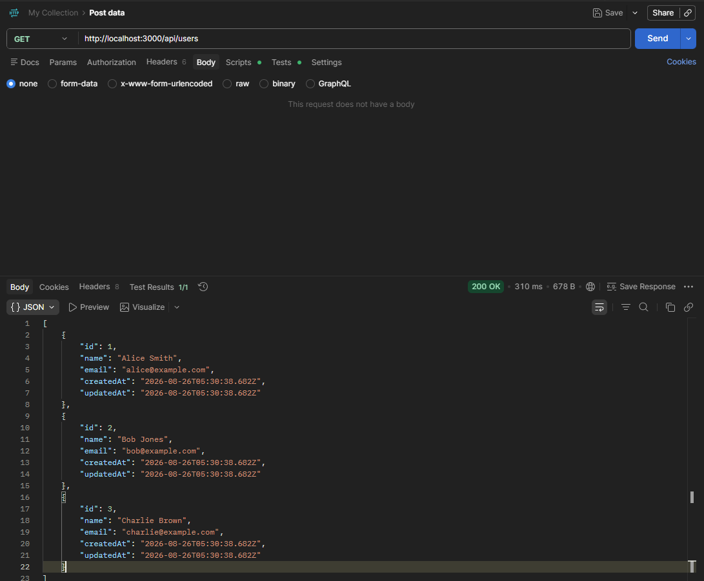
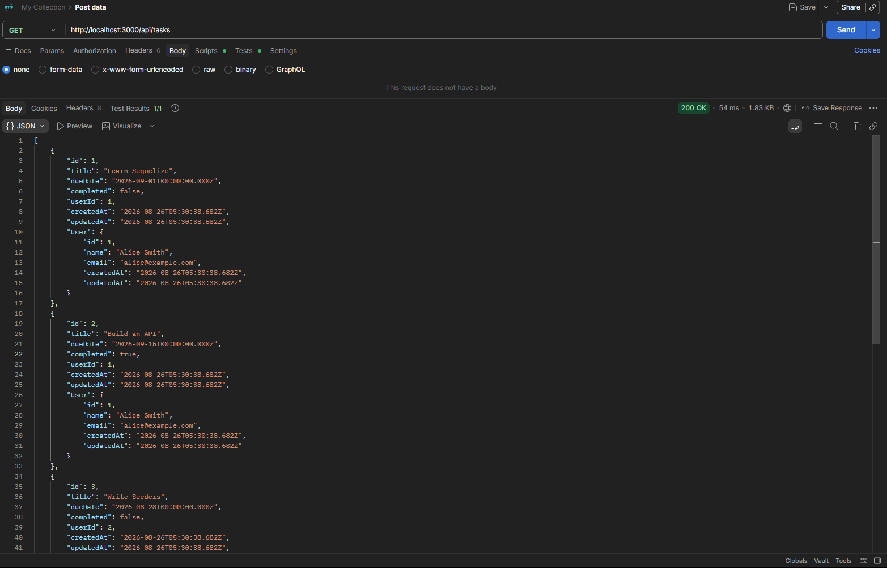
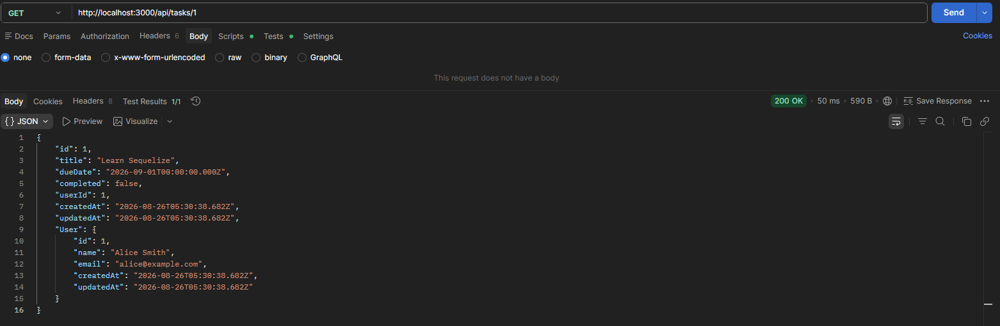
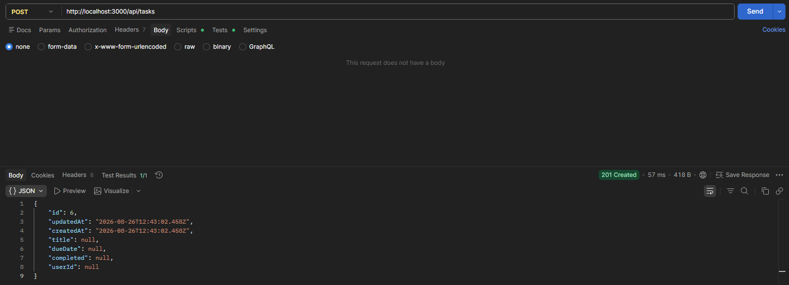
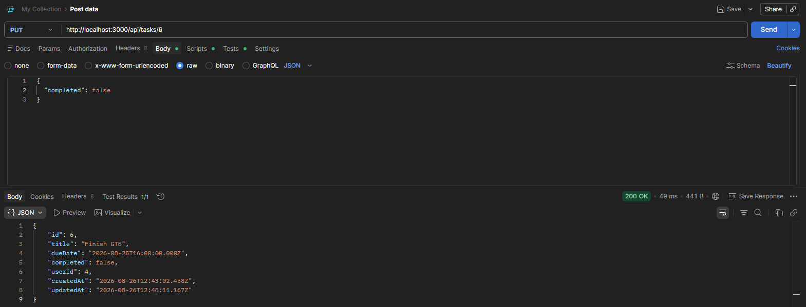
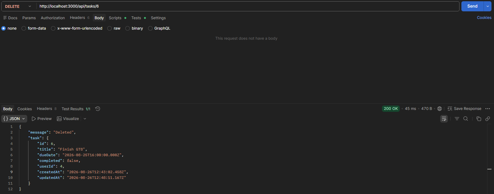
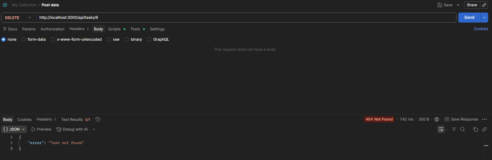

# itelect2-project
My IT Elective 2 backend web development project.

## API Testing

1. Get Request

2. Post Request

3. Put Request

4. Delete Request

## GT8

1. Get Request

2. Post Request

3. Put Request

4. Delete Request

